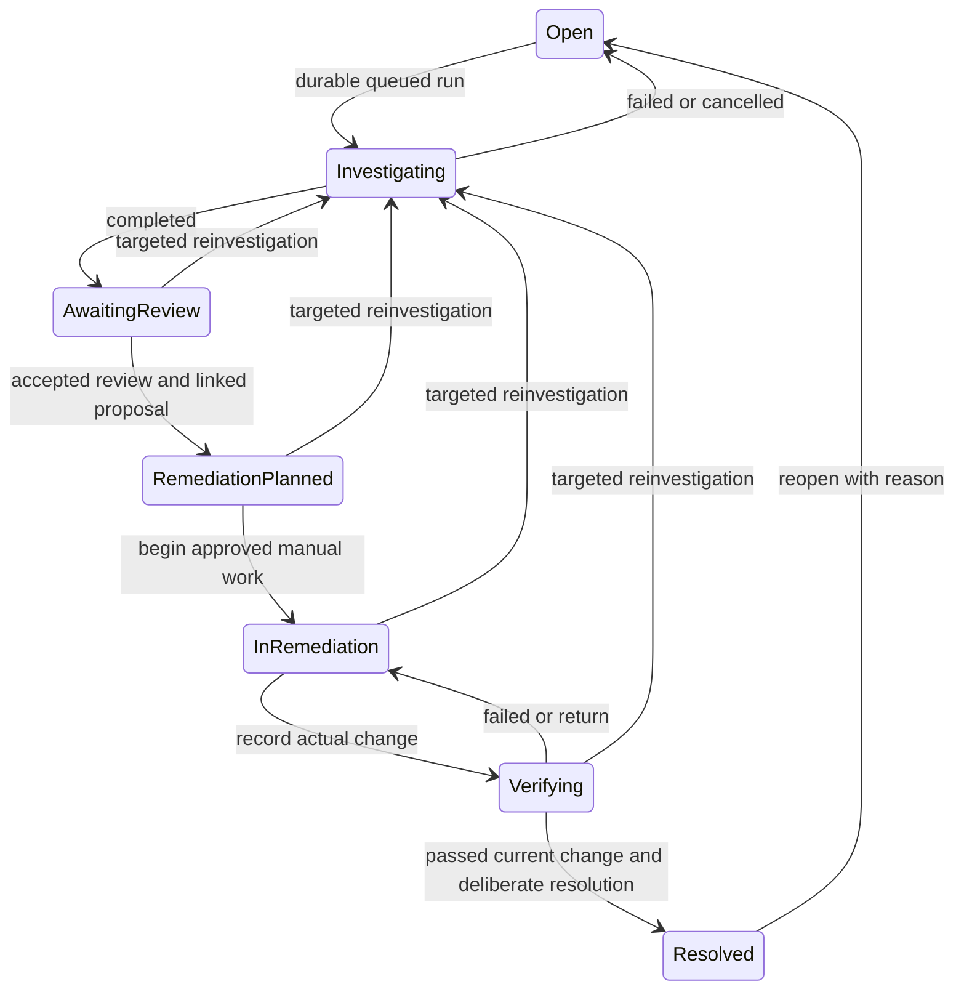

# Phase 3 architecture — Completion Pass 1

The existing `IncidentWorkflow` is the authoritative persisted lifecycle. `Incident.status` is a monotonic, version-fenced compatibility projection, never an independent workflow. `incidentLifecycle.js` owns adoption, compare-and-swap updates, queue attachment and terminal reconciliation. Lists, workspace, actions and Overview use canonical state; Overview repairs projections before counting. Existing records and output fields remain intact.

| Workflow stage | Public status | Permitted progression |
| --- | --- | --- |
| detect | Open | Submit investigation |
| investigate | Investigating | Completed → review; failed/cancelled → Open |
| review | Awaiting review | Accept/reject findings; accepted proposal → plan; reinvestigate |
| plan | Remediation planned | Approver decision; approved proposal → remediation; reinvestigate |
| remediate | In remediation | Record externally performed approved change → verify; reinvestigate |
| verify | Verifying | Passed/inconclusive stay here; failed → remediation; return to remediation; reinvestigate |
| resolved | Resolved | Reopen with reason → Open; draft/approve/index report |

## Durable data relationships

`Incident` retains original title, description, severity, service and legacy agent outputs. One `IncidentWorkflow` stores current stage/version, review/proposal pointers, human changes, verifications, resolutions, reports and chronological audit history. `InvestigationRun` stores immutable run identity, attempts, leased worker ownership, actual runtime events/timing, outputs and cancellation/failure. `RemediationProposal` links incident, completed run and accepted review; ownership/draft edits/reviews have their own version and audit. Proposal approval does not mean execution. Manual change and verification records link to the approved proposal/current change respectively.

Standalone MongoDB is supported without transactions: a persisted pending-investigation outbox is CAS-written before delivery, run upsert uses a unique incident/idempotency key, queue attachment and terminal reconciliation deduplicate run IDs, and projections can be repaired by readers/worker. A proposal saved before a concurrent workflow conflict remains historical; retrying its same key can link it if the accepted review still applies. Approval and manual execution independently validate current review linkage. A crash can leave a temporarily stale projection, but canonical reads repair it. This is eventual cross-document consistency, not a multi-document atomic transaction.

Lazy adoption creates missing workflows idempotently. Legacy resolved incidents remain resolved; historical outputs imply Awaiting review; otherwise Open. Historical outputs/reviews/reports are preserved. Migration metadata describes adoption and does not invent past engineering decisions. Existing running/terminal runs are adopted and reconciled. Old accepted reviews are normalized to a current pointer when applicable. Historical unlinked proposals remain readable/editable; they cannot authorize execution. Create a new linked proposal after current findings review.

## Actual progress and recovery

Python `/analyse-stream` emits NDJSON at real specialist start/completion/failure, with measured elapsed time and existing agent outputs. Node validates ordered frames and persists leased stage events. No timers synthesize stages. Gateway SSE uses persisted event IDs and the browser reconnects with its cursor, cleans up on navigation and falls back to polling. Cancellation fences persistence, while an already running upstream call may finish. Worker retries/backoff/lease recovery survive gateway/browser disappearance. Terminal reconciliation occurs exactly once per run; previous runs and reviews stay historical.

## Session and navigation

A configured operations credential is exchanged at `/api/session` for a random HttpOnly SameSite=Strict cookie, Secure in production. MongoDB stores its hash, expiry and credential fingerprint. Rotation invalidates old sessions. The CSRF value is restored via authenticated GET and retained only in memory; cookie-authenticated mutations require it. No bearer token is stored in localStorage, history or URLs. Engineer/viewer/approver/administrator roles remain configured identities, not Entra SSO or per-workspace authorization.

Frontend Fetch uses same-origin cookies and Vite proxies API calls to 5050. `/incidents/:id` is the stable bookmark, with pushState/popstate, direct restore and explicit invalid/unauthorized states. Production hosting must serve SPA fallback for these paths and proxy API on the same origin over HTTPS. Session expiry clears protected workspace data and offers sign-in.

## Boundaries

Remote execution remains disabled. Manual verification is human evidence, not measured Azure recovery. GitHub/Azure/Foundry read-only adapters and lexical report learning remain. Workflow history lives in one MongoDB document; archival/retention and query optimization remain needed at scale. Repair scans make Overview consistent but add work proportional to incident count. Actions/incident lists remain bounded to their existing latest-500 view; run/proposal pages expose older history, capped at 100 pages of 20.

## Completion Pass 2 additive evidence architecture

EngineeringSignal is an observed provider event, separate from Incident. A unique normalized key suppresses workflow-run/attempt and deployment-status replays. Signed GitHub workflow/deployment delivery and an authenticated configured Azure alert relay normalize source identifiers, observed/received times, severity, correlation and delivery audit. Authenticated engineers may retrieve a failed run, create/attach its signal, and enqueue through existing lifecycle/outbox. Opt-in severity policy correlates existing unresolved incidents from the last 24 hours, with a configured time bucket for concurrent first creation. Polling is disabled by default, first page only, at most ten failed runs from 24 hours, nonoverlapping and at least 60 seconds apart.

EngineeringEvidence retains triggering evidence plus immutable incident/run-scoped observations. Collection is limited to five associated signals, first 30 jobs, at most two failed job excerpts per signal and the directly referenced commit/deployment. GitHub log downloads stop at 64 KiB; stored excerpts stop at 12,000 characters. Commit patches are bounded and unavailable patches are explicit. Provider IDs establish direct linkage; a commit is potentially relevant, not established causal evidence. Azure signal collection discovers definitions, optionally retrieves AZURE_INVESTIGATION_METRIC, and retrieves configured request/exception templates as potentially relevant observations. No service mapping is inferred from subscription membership.

The worker preserves the existing five-passage runtime contract (up to four operational passages plus one knowledge passage; five knowledge passages if no operational evidence). Full retained sources remain inspectable. Python context-local decorators record actual GitHub REST, Azure inventory and Foundry calls, with sanitized outcomes/duration; model response metadata supplies deployment and token counts only when present. Tool frames are emitted after the synchronous stage returns, before the stage completion frame. Existing stage events remain authoritative. Collection activity and runtime tools persist on the leased run. Retry event ranges are spaced by 1000 to preserve SSE cursor ordering; exhausted leases use terminal ID 9999. No costs are inferred; no OpenTelemetry exporter is configured.

MeasuredVerification is separate from manual workflow observations. The backend retrieves baseline/current Azure Monitor data, links the current recorded change/proposal, and rechecks the change after collection. Comparisons require compatible provider/resource/metric/unit/aggregation, equal-duration nonoverlapping windows bracketing the change, complete aligned five-minute buckets and no truncation/missing values. Total/Count sum buckets; Minimum/Maximum take extrema; Average uses an explicitly unweighted equal-bucket mean. Maximum/minimum thresholds or percentage reductions produce an explanation and passed/failed/inconclusive. A measured outcome never changes the lifecycle or resolves an incident.

KnowledgeDocument chunks optionally retain genuine local Ollama vectors and model/dimension/provider metadata. MongoDB holds the local vector index; cosine ranking examines the latest 100 workspace documents, with explicit truncation. Model/dimension changes require reindex; unavailable/no compatible vectors return labeled lexical fallback. No synthetic embedding generation exists. Ingestion/indexing is synchronous and bounded; bulk indexing and hybrid ranking remain limitations.

GitHubChangeIntent retains reviewed explicit file content, exact full-file diff, base SHA, policy scope, proposal/review/version, actor, content hash, dedicated branch and remote step results. Confirmation requires its preparing actor, matching hash, current accepted review/approved linked proposal, current policy and unchanged base. A two-minute persisted claim excludes concurrent confirmation; step data allows safe retries and dedicated branch/PR reconciliation. Only existing bounded text files are supported. No autonomous patch generation, merge, deployment, Azure mutation or shell command exists. Remote operations cannot be atomically coupled to Mongo approvals; repeated gates reduce but cannot remove cross-service race risk.
